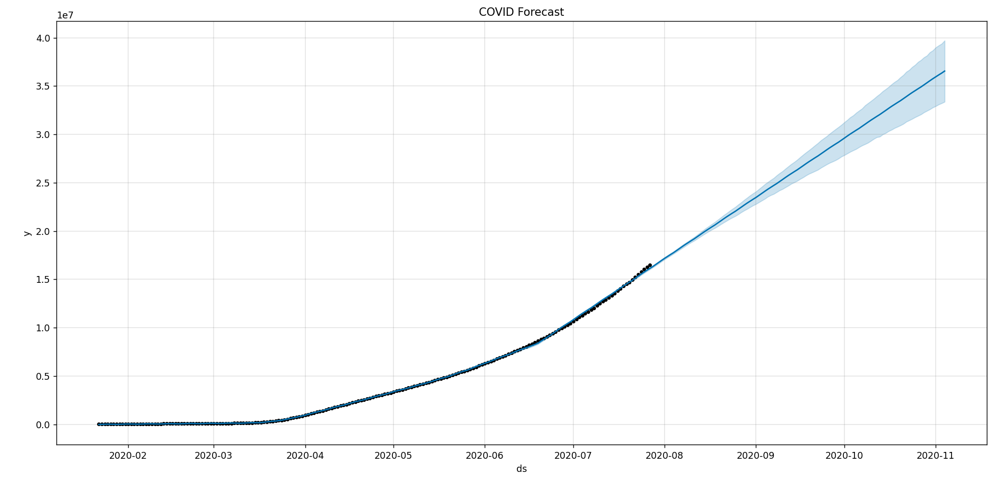
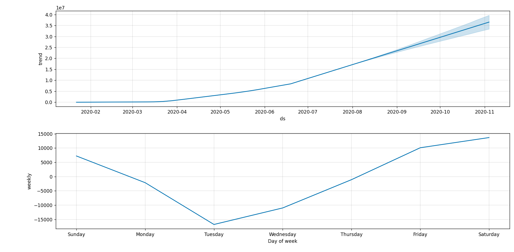
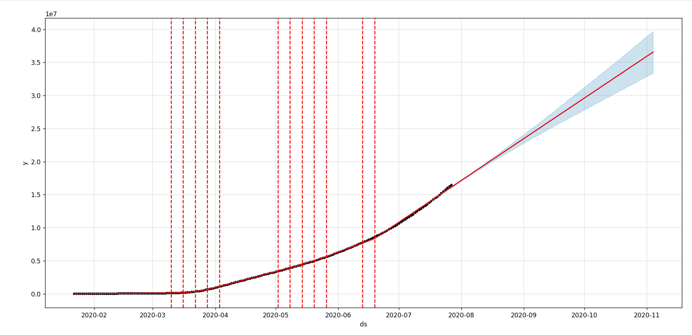

# 📊 COVID-19 Time Series Forecasting using Facebook Prophet

## 📌 Project Overview
This project uses Facebook Prophet to forecast COVID-19 confirmed cases based on historical time-series data. It captures trend, seasonality, and changepoints to predict future case values and evaluate model performance.

## 🎯 Objective
- Forecast future COVID-19 confirmed cases
- Analyze trend and seasonal patterns
- Evaluate model performance using cross-validation

## 📂 Dataset
- Source: Kaggle COVID-19 dataset
- Features:
  - Date
  - Confirmed cases
  - Deaths
  - Recovered
  - Active cases

## ⚙️ Technologies Used
- Python 🐍
- Pandas
- NumPy
- Matplotlib
- Seaborn
- Facebook Prophet

## 🧠 Model Used
Facebook Prophet (developed by Meta) is used for time-series forecasting. It handles:
- Trend detection
- Seasonality
- Missing values
- Changepoint detection

## 🔄 Workflow
1. Data Cleaning & Preprocessing  
2. Grouping data by Date  
3. Converting into Prophet format (ds, y)  
4. Model Training  
5. Future Forecasting (100 days)  
6. Visualization of results  
7. Cross-validation & performance evaluation  

## 📊 Results

### 🔹 Forecast Plot (Future Predictions)

### 🔹 Trend + Seasonality Analysis

### 🔹 Cross Validation Performance

## 📉 Model Performance
- MAPE: ~1.6% to 2.7%
- MAE: ~129K to 233K
- RMSE increases with forecast horizon

👉 Model performs well for short-term forecasting

## 📌 Key Insights
- COVID-19 cases show strong upward trend
- Weekly seasonality patterns are observed
- Prophet captures time-series structure effectively
- Best suited for short-term forecasting

## 👩‍💻 Author
Anushka Pal  
Data Science | Machine Learning | Time Series Forecasting  

## 📌 Conclusion
This project demonstrates time-series forecasting using Facebook Prophet with strong trend capture and low forecasting error, making it suitable for real-world predictive analytics.